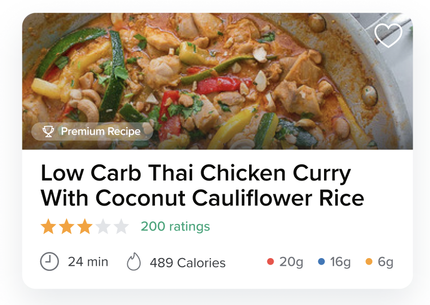
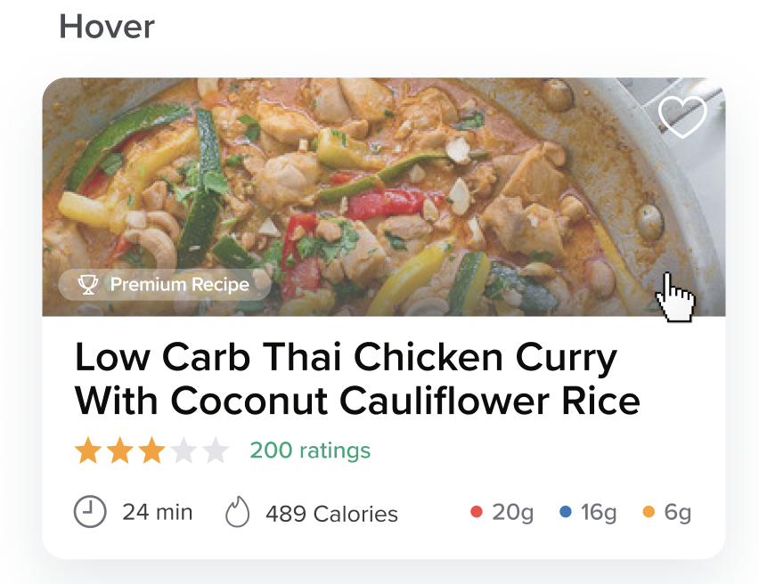

# Carb Manager Dev Assignment

## Design

**Card:**



**Hover:**

20% opacity white fill when hovering over the card.



**Figma Link:**

[Link coming soon]()

---

## Assignment Requirements:

### UI

- Translate the design as closely as possible to custom CSS. We've also provided hover styles for you to replicate.
- Use SVG's for the custom icons. These can be grabbed from the Figma file.
- Make sure the Recipe title gets truncated after 2 lines
- The star ratings should be able to work with half-stars.
- If a recipe duration is longer than 60 minutes, the format should be `x hr x min`
- Add an `energy-units` prop which will take either `calories` (default) or `kilojoules`. This will determine which energy value/unit to display. 1 calorie = 4.184 kJ. The number value passed in as a prop will always represent calories, so if `kilojoules` is selected, a conversion needs to take place.

### Interactions

- The whole card will be clickable. Make sure that the event is working properly. You should see a "clicked" message in the Storybook "actions" tab when clicking on the component.
- The "heart" in the top right won't be clickable, but it should be filled in based on a certain prop value.

### Storybook

Create a Storybook story to view the component in isolation and to be able to interact with all available props.

There is a `PremiumRecipeCard.stories.js` placeholder file that you can use to get started. Take a look at the [addon-knobs](https://www.npmjs.com/package/@storybook/addon-knobs) documentation to help you get started if you are unfamiliar with Storybook.

### Tests

There is a `PremiumRecipeCard.spec.js` file which you can use to write some tests. These tests are completely up to you. Try to come up with some useful test cases.

**Hint:** The calorie -> kilojoules conversion will be a good test case to make sure the conversion is working properly.

### Other Notes

- Fork this repo to get started. Please don't create everything with just one commit. We would love to see how you structure your commits.
- Don't feel like you have to stay within the placeholder files.  If you want to create some helper/utility functions, go ahead and create the appropriate file/folders for that. 
- If you see any component inside of this Recipe Card that might be useful to re-use in other areas, feel free to split it out into its own component. Don't overengineer it, but there might be something that could be re-used.
- Macro dots
  - Red: Carbs
  - Blue: Protein
  - Yellow: Fats
- If you are unclear about something or want to run something by me, please feel free to shoot me an email.

---

## Project setup

```
yarn install
```

### Compiles and hot-reloads for development

```
yarn serve
```

### Run Storybook

```
yarn storybook
```

### Run your unit tests

```
yarn test:unit
```
